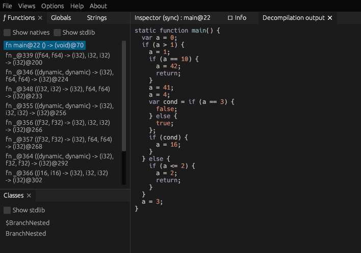

# hlbc-gui [](https://crates.io/crates/hlbc-gui)

A graphical user interface for hlbc.



It also runs on the web ! The latest release is available at : https://gui-yom.github.io/hlbc

No need to download anything and the web app is entirely client side, your bytecode file stays local.

---

## Installation

Download a prebuilt binary from the [releases page](https://github.com/Gui-Yom/hlbc/releases) (built from the CI,
Windows & Linux).

Or build from the latest version :

```shell
cargo install hlbc-gui
```

Or build the crate from the latest sources :

```shell
git clone https://github.com/Gui-Yom/hlbc
cd hlbc/crates/hlbc-gui
cargo build --release
# The resulting binary can be found in ../target/release
```

## About the GUI

The GUI is immediate mode and is built with egui. I would very like to find a retained mode GUI framework but the options are still scarce in Rust. I need something complete and cross-platform. It needs to have support for rich text (code display) and a docking UI (or implementable at least), and also not be ugly.
- Xilem ? Too damn early, it's still at prototyping stage.
- Floem ? Too damn early too, also a stock application consumes 500MB+ of memory which is kinda ridiculous.
- GTK ? Probably the best option. I should look into it.
- Web UI ? e.g. tauri / ultralight. Web is meh but allows for anything. I would love a stripped down and embeddable html/css engine without any javascript where events are handled directly in Rust. Maybe sciter ?
- Flutter ? having looked that much into it.
- Qt ? are the rust bindings functional ?

The thing is, egui sometimes feel subpar but is good enough everywhere. The ecosystem is nice and the development experience is amazing. Difficult to find better.
