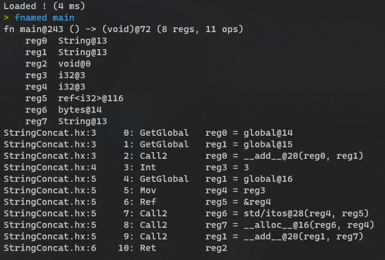

# hlbc-cli [](https://crates.io/crates/hlbc-cli)

[**H**ash**l**ink](https://hashlink.haxe.org/) **b**yte**c**ode disassembler, decompiler and analyzer command line
interface.

*This crate is a program, see [hlbc](https://crates.io/crates/hlbc) for the core bytecode library
or [hlbc-decompiler](https://crates.io/crates/hlbc-decompiler) for the decompiler library*



---

## Installation

Download a prebuilt binary from the [releases page](https://github.com/Gui-Yom/hlbc/releases) (built from the CI,
Windows & Linux).

Or build from the latest version :

```shell
cargo install hlbc-cli
```

Or build the crate from the latest sources :

```shell
git clone https://github.com/Gui-Yom/hlbc
cd hlbc
cargo build --release
# The resulting binary can be found in target/release
```

## Usage

`hlbc <file> [-c <command>] [-w <command>]`

You get access to a prompt where you can enter commands.

You can execute commands on startup with the `-c` switch.
e.g. Dump all strings from the bytecode then exit : `hlbc main.hl -c "s ..; exit"`.
If you omit the `exit` command, the app will simply launch the normal prompt after executing the startup commands.

With `-w`, the given command will execute each time the file changes. The cli won't show a command prompt.

You can also pass a `.hx` file containing Haxe source code directly to be compiled on the fly if the haxe compiler is
present in the `PATH`.

## Commands

- `exit` Exit the program
- `help` Help message
- `explain <op>` Get information about an opcode
- `wiki` Open the bytecode wiki page in a browser
- `info` General information about the bytecode
- `entrypoint` Get the bytecode entrypoint
- `i|int <idx>` Get the int at index
- `f|float <idx>` Get the float at index
- `s|string <idx>` Get the string at index
- `sstr <str>` Find a string
- `d|debugfile <idx>` Get the debug file name at index
- `sfile <str>` Find the debug file named
- `t|type <idx>` Get the type at index
- `g|global <idx>` Get global at index
- `c|constant <idx>` Get constant at index
- `n|native <idx>` Get native at index
- `fnh <findex>` Get header of function (findex)
- `fn <findex>` Get function (findex)
- `sfn <str>` Get function named
- `infile <idx|str>` Find functions in file
- `fileof <findex>` Get the file where findex is defined
- `refto <any@idx>` Find references to a given bytecode element
- `saveto <filename>` Serialize the bytecode to a file
- `callgraph <findex> <depth>` Create a dot call graph from a function and a max depth
- `decomp <findex>` Decompile a function
- `decompt <idx>` Decompile a class

### Indexes

In most of the commands that accept an index, you can pass a Rust style range too : `a..b`, `..b`, `a..`, `a..=b`, `..`.
Where `..10` means '*select the first 10 items*' and `..` means '*display everything*'.

## Decompiler

The decompiler has its own crate ! More info [here](https://github.com/Gui-Yom/hlbc/blob/master/hlbc-decompiler).

## Changelog

See [CHANGELOG.md](CHANGELOG.md).

## Wiki

A wiki detailing the specifics of Hashlink bytecode is available [here](https://github.com/Gui-Yom/hlbc/wiki) or by
using the command `wiki`.

## Planned features

- Use commands as expressions in arguments to other commands to compose analysis like `fn (entrypoint)` to display the
  entry function or `refto (sstr Hello)`
